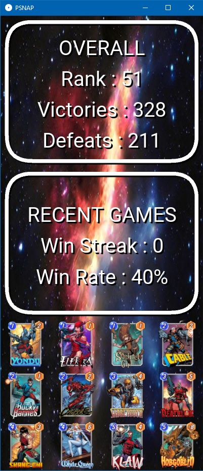

# PSNAP

## CSPILOT

PSNAP it is a personal tracker for the game Marvel Snap.

It allow you to visualize your current performances in the game and the current selected deck.

## USAGE

Change the file "__options.json__" in the "__data__" directory to set :

- __path__ : path to the game data folder ( usually __"C:\\Users\\YOUR_USERNAME\\AppData\\LocalLow\\Second Dinner\\SNAP\\Standalone\\States\\nvprod\\"__ )

- __bg_color__ : the background color for the text

- __fg_color__ : the foreground color for the text

- __bg_image__ : the background image ( it will be stretched to 400x900 pixels )  

## NOTES

Some card names may not match.

In this case edit the file "__cards.json__" in the "__data__" directory and modify the card entry with the correct card id name.

## INFO

The literal and graphical information presented on this site about Marvel Snap, including card images and card text, Marvel Heroes, The Marvel Snap CCG, and The Marvel Snap CCG Art and its trademarks are ©2022 Marvel. 
This program is not produced by, endorsed by, supported by, or affiliated with Marvel.